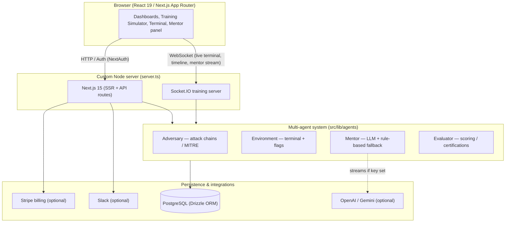

# SentinelForge

**SentinelForge** is an autonomous cybersecurity apprenticeship platform. Students train in live, generated lab environments while a multi-agent system runs alongside them: an **Adversary** that executes attack chains, a **Mentor** that streams Socratic guidance, an **Environment** agent that powers an in-browser terminal, and an **Evaluator** that scores skills and awards certifications. Organizations get analytics, hiring, and enterprise admin tooling on top.

Built with **Next.js 15** (App Router), a custom **Node + Socket.IO** server, **NextAuth**, **Drizzle ORM**, and **PostgreSQL**.

- **Live demo:** https://sentinelforge.onrender.com
- **Health check:** https://sentinelforge.onrender.com/api/health → `{ "status": "ok", "database": "up" }`

> The demo runs on Render's free tier, so the first request after idle takes ~30–50s to cold‑start. Refresh once and it stays warm.

---

## Demo credentials

All demo accounts use the password **`password123`**. Each lands on a fully seeded dashboard.

| Role | Email | What to look at |
|------|-------|-----------------|
| **Student** | `student1@state.edu` | Progress, skill radar, certifications, live training simulator |
| **Enterprise admin** | `enterprise.admin@acme.com` | Org analytics, team management, hiring portal |
| **Platform admin** | `admin@sentinelforge.com` | Cross‑org admin, scenarios, platform metrics |

The login screen has one‑click **"Use"** buttons that fill these in. Demo data (sessions, mentor conversations, skill history, certifications, hiring matches) is **seeded automatically on first deploy** (see [Seeding](#seeding)).

## Demo walkthrough

1. **Login** as `student1@state.edu` → land on a populated dashboard (streak, recent sessions, recommended scenarios).
2. **Training** → browse scenarios by difficulty/category → **Start session**.
3. In the simulator: the **Adversary** executes an attack chain automatically and the **attack timeline** updates live over WebSockets.
4. Use the **terminal** to investigate; ask the **Mentor** — replies stream token‑by‑token.
5. **Submit a flag** → scoring runs → progress + skill matrix update.
6. Visit **Progress** for score history, radar, and certifications.
7. Sign in as `enterprise.admin@acme.com` → **Analytics**, **Team**, and the **Hiring portal** (ranked candidate matches).

---

## Architecture



- **`server.ts`** boots Next.js and Socket.IO on one HTTP server, validates env, and handles graceful shutdown (SIGTERM closes sockets, HTTP, and the PG pool).
- **Agents** are deterministic by default. The Mentor uses OpenAI/Gemini when a key is present and **falls back to rule‑based responses** otherwise — no crashes, no blank screens.
- **Real‑time**: the training simulator uses Socket.IO with automatic reconnection (5 attempts, backoff) so a dropped connection recovers on its own.

### Project layout

- `src/app` — App Router pages, API routes, `error.tsx` / `global-error.tsx` / `loading.tsx`
- `src/lib/agents` — adversary, environment, mentor, evaluator, placement
- `src/lib` — Stripe billing, Slack, logger, rate limiter, metrics, RBAC, env checks
- `src/db` — Drizzle schema, queries, seeds (`seed.ts`, `enhanced-seed.ts`), migrations in `drizzle/`
- `src/middleware.ts` — security headers, rate limits, billing RBAC, public webhook
- `scripts/` — deploy + seed helpers, `docker-entrypoint.sh`, `seed-if-needed.ts`

---

## Local development

```bash
cp .env.example .env
# Minimum: set DATABASE_URL and AUTH_SECRET (openssl rand -base64 32)

npm install
npm run db:migrate
npm run db:seed            # scenarios, orgs, demo users
npm run db:seed:enhanced   # rich demo data for the accounts above

npm run dev                # Next.js + Socket.IO on http://localhost:3000
```

The dev server runs **`server.ts`**, starting Next.js and Socket.IO together.

### npm scripts

| Script | Purpose |
|--------|---------|
| `npm run dev` | Dev: Next + Socket.IO |
| `npm run build` | Production Next.js build |
| `npm run start` | Production server (`server.ts`) |
| `npm run lint` | ESLint |
| `npm run db:migrate` | Apply migrations |
| `npm run db:seed` | Base seed (scenarios, orgs, demo users) |
| `npm run db:seed:enhanced` | Rich demo data for advertised accounts |
| `npm run db:studio` | Drizzle Studio |

---

## Environment variables

Copy **`.env.example`** to `.env`. Only `DATABASE_URL` and `AUTH_SECRET` are required — everything else enables an optional integration and degrades gracefully when unset.

| Area | Variables | Required? |
|------|-----------|-----------|
| Database | `DATABASE_URL` | **Yes** |
| Auth | `AUTH_SECRET`, `AUTH_URL` / `NEXTAUTH_URL` | **Yes** (`AUTH_SECRET`) |
| AI mentor | `OPENAI_API_KEY` (preferred) or `GEMINI_API_KEY`, optional `*_MODEL` | Optional — falls back to rule‑based |
| OAuth | `GOOGLE_CLIENT_ID/SECRET`, `SLACK_CLIENT_ID/SECRET` | Optional |
| Slack app | `SLACK_BOT_CLIENT_ID/SECRET`, `SLACK_SIGNING_SECRET`, `SLACK_TOKEN_ENCRYPTION_KEY` | Optional |
| Stripe | `STRIPE_SECRET_KEY`, `STRIPE_WEBHOOK_SECRET`, `STRIPE_PRICE_*` | Optional |
| App / sockets | `NEXT_PUBLIC_APP_URL` | Optional |
| Remote seed | `SEED_SECRET` | Optional (see below) |

On Render, `RENDER_EXTERNAL_URL` is automatically mapped to `AUTH_URL` / `NEXTAUTH_URL` / `NEXT_PUBLIC_APP_URL` at startup (see `src/lib/env-check.ts`). The server validates required env at boot and **fails fast in production** if `DATABASE_URL` / `AUTH_SECRET` are missing.

### Enabling the live AI mentor

Set **`GEMINI_API_KEY`** (or `OPENAI_API_KEY`) in the environment and redeploy. Streaming responses turn on automatically; without a key the Mentor still works via deterministic rule‑based guidance.

---

## Production deployment

### Render (used by the live demo)

The repo ships a **`render.yaml`** Blueprint (Docker web service + managed Postgres).

```bash
# One-time: Render Dashboard → New → Blueprint → connect this repo
render blueprints validate render.yaml     # validate locally

# Ongoing (Render CLI): trigger a deploy of the latest commit on main
render deploys create <service-id> --wait --confirm

# Verify
curl https://sentinelforge.onrender.com/api/health
```

`scripts/deploy-render.sh` wraps deploy / logs / health / seed. See **[docs/DEPLOY_CLI.md](docs/DEPLOY_CLI.md)** for Fly.io and Docker targets.

### Docker (self-hosted)

```bash
cp .env.example .env.prod   # fill secrets + your domain
docker compose -f docker-compose.prod.yml --env-file .env.prod up -d --build
```

The image entrypoint (`scripts/docker-entrypoint.sh`) applies migrations, runs the idempotent seed guard, then `exec`s the server so SIGTERM reaches Node for graceful shutdown. `docker-compose.prod.yml` adds Postgres, Redis, and an nginx reverse proxy (`deploy/nginx.conf`).

> This app uses a custom Node server for Socket.IO, so it is **not** deployable to serverless‑only targets (e.g. Vercel functions). Use a container/VM host.

---

## Seeding

Demo data is populated **automatically on first boot**: `scripts/seed-if-needed.ts` runs after migrations, checks whether the demo student already has completed sessions, and if not runs the base + enhanced seeds. It never blocks or fails startup.

To seed manually:

```bash
# Locally / against an external DATABASE_URL
npm run db:seed && npm run db:seed:enhanced

# Remotely over HTTP (set SEED_SECRET on the service, then):
SEED_SECRET=your-secret ./scripts/seed-remote.sh
```

Both seeds are **idempotent** — re‑running will not duplicate data.

---

## Health, monitoring & operations

- **`GET /api/health`** → `{ status, database, timestamp }` (public, not rate‑limited).
- **Error boundaries**: `src/app/error.tsx` (per‑segment) and `src/app/global-error.tsx` (root layout) log via the structured logger and show a recovery UI — users never see a raw stack trace.
- **Structured logging** (`src/lib/logger.ts`) redacts secrets and emits JSON in production.
- **Rate limiting & security headers** via `src/middleware.ts`.
- **Graceful shutdown** closes Socket.IO, the HTTP server, and the Postgres pool on SIGTERM/SIGINT.
- **CI** (`.github/workflows/ci.yml`): `npm ci`, lint, `tsc --noEmit`, `next build`, and a Docker build.

## License

Private / unlicensed unless otherwise specified by the repository owner.
